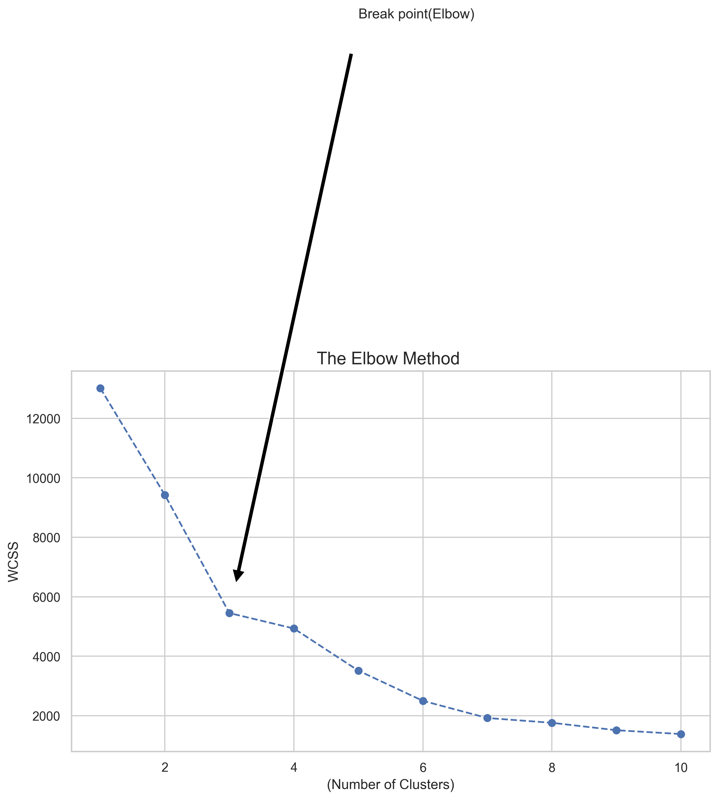

# Customer Segmentation Analysis (RFM + K-Means)

## Project Overview
In this project, I analyzed over 540,000 transactions from an online retail dataset to group customers based on their buying patterns. I transformed the raw transaction data into a **Recency, Frequency, and Monetary (RFM)** model.

## Why RFM?
* **Recency (R):** Days since the last purchase.
* **Frequency (F):** Total number of purchases.
* **Monetary (M):** Total money spent by the customer.

## My Approach
1.  **Data Cleaning:** Handled missing values and removed cancelled orders.
2.  **Feature Engineering:** Aggregated the 540k+ rows into unique customer profiles.
3.  **Determining Clusters:** Used the **Elbow Method** to find the optimal number of segments.
4.  **Clustering:** Applied the **K-Means algorithm** to label each customer group.

## Findings: The Elbow Method
By plotting the WCSS, I identified a clear "elbow" at **k=3**. This indicates that dividing the customers into 3 distinct groups provides the best balance between simplicity and detail.

## Key Learnings
- Processing large-scale datasets (500k+ rows) with Pandas.
- Implementing unsupervised machine learning (K-Means).
- Translating technical data into business insights.

## Author
* **Name:** [Maryam Larimian]
* **Location:** Germany